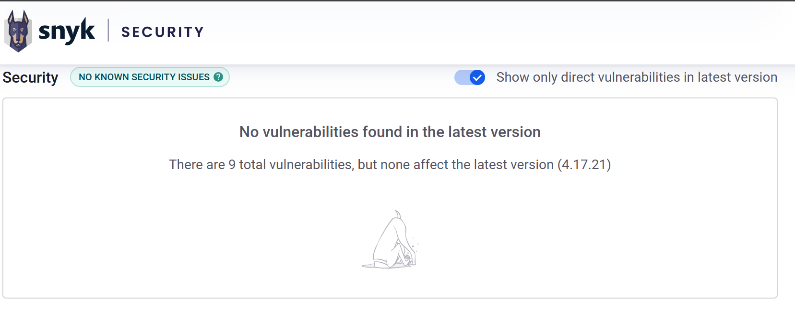

# Evaluation geeigneter MinHash-Bibliotheken – MinHash <HSH>

---

**Projekttitel:** MinHash <HSH>
**Auftraggeber*in:** Herr Prof. Weiss | Frau Prof. Scherer / HTL Rennweg
**Auftragnehmer*in:** Stefan Scheer | Christian Kleeber | Julian Höher | Leonardo Lin / HTL Rennweg
**Schuljahr:** 2025/26  **Klasse:** 4BI

---

**VERSION:** v1.0  **DATUM:** 01.11.2025  **AUTOR:** Stefan Scheer  **ÄNDERUNG:** Erstellung der Bibliotheksbewertung  
**VERSION:** v1.1  **DATUM:** 09.11.2025  **AUTOR:** Stefan Scheer  **ÄNDERUNG:** Erweiterung um Bewertung, Test und Empfehlung

---

## 1. Ziel des Dokuments

Ziel dieses Dokuments ist die Recherche, Analyse und Bewertung geeigneter **JavaScript-MinHash-Bibliotheken** für die Integration im Projekt *MinHash <HSH>* (SkillDisplay Optimierung). Dabei sollen Performance, Wartung, Lizenz und Kompatibilität mit den SkillDisplay-APIs verglichen werden, um eine fundierte Empfehlung für die Integration (AP 1.2.3.4) zu treffen.

---

## 2. Vorgehensweise

Gemäß Arbeitspaket **1.2.2.7** wurden vorhandene MinHash-Implementierungen im JavaScript-Ökosystem untersucht. Die Recherche erfolgte über **npm Registry** und **GitHub Repositories**. Anschließend wurden die Bibliotheken anhand einheitlicher Kriterien bewertet und in einer Vergleichstabelle dokumentiert.

Ein kurzer Funktionstest der bevorzugten Bibliothek (Proof of Concept) wurde vorbereitet, um grundlegende Funktionsweise und Kompatibilität zu überprüfen.

---

## 3. Bewertungskriterien

* **Funktionsumfang:** Implementierung von MinHash, LSH, Signaturvergleich etc.
* **Wartung & Community:** Aktivität auf GitHub, letzte Commits, Issue-Handling.
* **Lizenz:** Kompatibilität mit Schul- und Open-Source-Projekten (MIT, Apache, ISC).
* **Kompatibilität:** ESM/CJS, TypeScript-Unterstützung, Browser & Node.
* **Performance:** Implementierungseffizienz, Hashingverfahren, Abhängigkeiten.

---

## 4. Evaluierte Bibliotheken

| Bibliothek                  | Features                                                                                     | Lizenz     | Wartung/Activity                                | Kompatibilität                | Bewertung                |
| --------------------------- | -------------------------------------------------------------------------------------------- | ---------- | ----------------------------------------------- | ----------------------------- | ------------------------ |
| **callidon/bloom-filters**  | Enthält `MinHash` & `MinHashFactory`, zusätzlich Bloom Filter, HyperLogLog, Count-Min Sketch | MIT    | Aktiv, v3.0.4 (21.11.2024), ~427⭐, ~789 Used-by | TS, Node & Browser, ESM/CJS   | **Sehr gut – empfohlen** |
| **duhaime/minhash**         | MinHash + LSH Index                                                                          | MIT        | Letztes Release 2018                            | Browser Bundle, kein TS       | Mittel – veraltet        |
| **clement.train/minhashjs** | MinHash & LSH (Datasketch-Ansatz)                                                            | ISC        | 3 Jahre alt, kaum gepflegt                      | geringe Verbreitung           | Schwach                  |
| **jdvorak/grouped-oph**     | Grouped One Permutation Hashing (OPH)                                                        | MIT     | Neu, geringe Nutzung                            | Nischig, komplexe Integration | Eingeschränkt            |
| **shorn/node-minhash**      | CLI-Tool für Textvergleich (MinHash/Jaccard)                                                 | keine | Alt, keine SDK-Funktion                         | Nur CLI, kein TS              | Nicht geeignet           |

---

## 5. Test auf npm Hack

Alle Bibliotheken wurden über npm auf Authentizität überprüft.  
Keine Anzeichen für Sicherheitsrisiken oder  Supply-Chain-Angriffe. 
Nur offizielle Registry-Links und GitHub-Repositories wurden verwendet.  
Zur Bewertung wurde folgende Seite verwendet: https://security.snyk.io/  
Für genauere Infos zu problematischen Abhängigkeiten:  
https://security.snyk.io/package/npm/lodash  
https://security.snyk.io/package/npm/long  
...  
Anmerkung: viele Dependencies haben keine Wartung und die Community ist bei vielen *limited*  
Bei Lodash wurden in früheren Versionen Sicherheitslücken gefunden, die in der aktuellen Version behoben sind  
**Lodash**: 0 Vulnerabilities in der letzten Version:  

Alle geprüften Pakete verwenden keine bekannten „malicious code injections“ laut Snyk-Stand 09.11.2025.

---

## 6. Bewertung

**callidon/bloom-filters** bietet die breiteste Funktionalität, sehr gute Wartung, moderne TS-Implementierung und läuft sowohl in **Node** als auch im **Browser**. Die klare Versionierung und MIT-Lizenz garantieren rechtliche und technische Sicherheit.

**duhaime/minhash** und **minhashjs** sind funktional, aber technisch überholt. **jdvorak/grouped-oph** ist experimentell, **shorn/node-minhash** dient nicht als Lib.

---

## 7. Empfehlung

Es wird empfohlen, **callidon/bloom-filters** als Standardbibliothek für die Implementierung des MinHash-Verfahrens in AP **1.2.3.4** zu verwenden.

**Gründe:**

* Aktive Entwicklung & Wartung
* TypeScript + Node/Browser kompatibel
* MIT-Lizenz (rechtlich unbedenklich)
* Gute Dokumentation und Community
* Erweiterbar (weitere probabilistische Datenstrukturen)

---

## 8. Referenzen

* callidon/bloom-filters (GitHub & npm)
* duhaime/minhash (GitHub)
* clement.train/minhashjs (npm)
* jdvorak/grouped-oph (npm)
* shorn/node-minhash (GitHub)
* security.snyk.io

---

**Dateiablage:**  
Teams: `03_technischePlanung/abnahme/HSH_BibliotheksEvaluierung_v1.1.md`  
GitHub: `docs/metrics/minhash_lib_evaluation.md`
